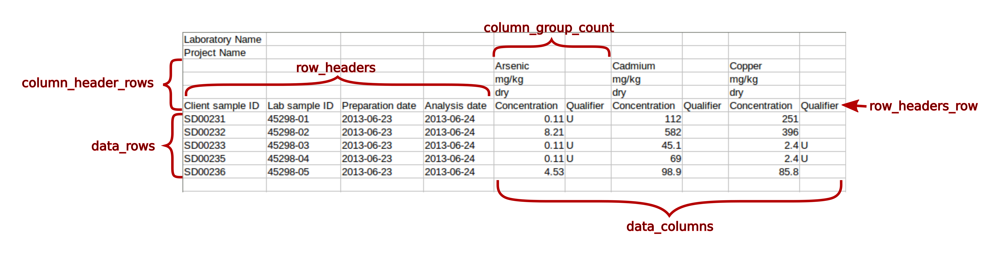

.. _configuration:

Configuration
===========================

Because of the variety of layouts of crosstabbed data, the information necessary to
describe each crostabbed file can be complex. For this reason, and also to facilitate
documentation of the way in which a file was handled, the un-crosstabbing information
is read from a configuration file rather than passed to the program on the command line.

The configuration file may contain several sections, where each section contains
configuration data for a separate data set to be normalized. For example, each section
in a configuration file could pertain to a different worksheet in an Excel workbook of
crosstabbed data.

Each section is identified by a unique name. The name must be enclosed in square brackets, e.g.:.

.. code-block:: none

    [section_name]

The configuration data in each section consists of a set of pairs of keywords and values.
The keywords and values must be separated by a colon or an equal sign, e.g.:

.. code-block:: none

    key:value

or

.. code-block:: none

    key=value

Each configuration option must be on its own line. Comment lines can be included in the
configuration file; these must begin with a hash symbol (#). The configuration keywords
and their meanings are as folllows.

data_columns
    A list of the columns in the input file containing crosstabbed data that are to be normalized.
    The list may consist of comma-separated column numbers or ranges; ranges consist of two
    column numbers separated by a dash.  There should be no spaces in the list.  In addition to
    column numbers, letters may also be used as column identifiers, as in spreadsheets.

data_rows
    A list of the rows containing data to be normalized.
    The list may consist of comma-separated row numbers or ranges; ranges consist of two
    row numbers separated by a dash.  There should be no spaces in the list.

row_headers
    A list of the columns to the left (or right) of the crosstabbed data columns that are to
    be preserved in the normalized output.  The list may consist of comma-separated column
    numbers or ranges; ranges consist of two row numbers separated by a dash.  There should
    be no spaces in the list.

column_header_rows
    A list of the rows containing column header values that are to be used in the normalized output.
    The list may consist of comma-separated row numbers or ranges; ranges consist of two
    row numbers separated by a dash.  There should be no spaces in the list.

column_group_count
    The number of columns (they must be contiguous) containing related data values that should
    appear on the same row of the normalized output.

column_header_label_#
    The header text (label) for one of the column_group_count output columns. The value consists
    of either two digits or a string. If the value is two digits, these refer to a cell in the
    matrix of column header cells (column_header_rows by column_group_count). The digits are the
    row number and the column number, in that order. If the value is a string, the string is used
    directly. There should be exactly column_header_count column_header_label keywords, and each
    keyword should include a numeric suffix to make it unique. The numeric suffixes should range
    from 1 to column_group_count.

header_as_column_#
    A multi-part value that identifies a cell in the matrix of (column_header_rows by
    column_group_count) cells that contains a value that is to be propagated into the normalized
    output as a new column. The multi-part value consists of two digits and a string. The two digits
    identify the cell in the column header matrix that is to be used as a data value. The digits are
    the row number and the column number, in that order. The string is used as the header for that
    column.

row_headers_row
    The row on which the headers for the row_headers columns appear. This configuration parameter
    is optional. If omitted, the maximum of column_header_rows will be used. If specified, the value
    must be one of the column_header_rows.

nd_values
    A list of strings that represent missing values in cells of the crosstabbed data table. If all
    column_header_count values of a set are missing, a row will not be written to the output file
    for this set of values. 

List values should be separated by commas. Numeric lists may include ranges, consisting of two
integers separated by a dash. All configuration parameters are required except for nd_values.
The meaning of several of these configuration parameters is illustrated in the following figure.

An example set of configuration parameters is shown below. This are the parameters that were
used to normalize the chemical data set shown above.

.. code-block:: none

	[concentration_data]
	data_columns=5-10
	data_rows=7-11
	row_headers=1-4
	column_header_rows=3-6
	column_group_count=2
	column_header_label_1=Concentration
	column_header_label_2=Qualifier
	header_as_column_1=1,1,Analyte
	header_as_column_2=2,1,Units
	header_as_column_3=3,1,Measurement basis

